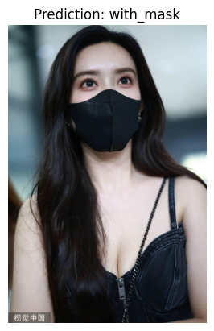
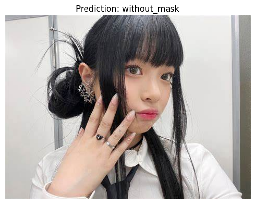
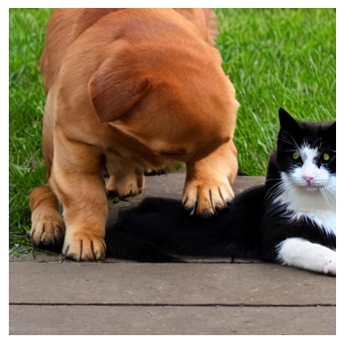

# HW6-1:Transfer learning on pretrained VGG 16

## 目錄結構

HW6 Transfer Learning and Hugging Face/  
├── docs/  
├── test/&nbsp;&nbsp;&nbsp;&nbsp;   # 測試數據集 (Test Data Directory)  
├── train/&nbsp;&nbsp;&nbsp;&nbsp;   # 訓練數據集 (Train Data Directory)  
├── HW6-1.ipynb&nbsp;&nbsp;&nbsp;&nbsp;   # HW6-1 的 Jupyter Notebook  
├── HW6-2.ipynb&nbsp;&nbsp;&nbsp;&nbsp;   # HW6-2 的 Jupyter Notebook  
└── README.md&nbsp;&nbsp;&nbsp;&nbsp;   # 專案的說明文件  

由於我的 CUDA 版本和 TensorFlow 不匹配，所以我這邊改成 PyTorch。  
```python
install torch torchvision torchaudio --index-url https://download.pytorch.org/whl/cu124
```
`test` 和 `train` 為 Kaggle 下載的 Face-Mask-Detection 數據集。  


##  step 1: build vgg 16 pretrained model


```python
Using device: cuda

VGG(
  (features): Sequential(
    (0): Conv2d(3, 64, kernel_size=(3, 3), stride=(1, 1), padding=(1, 1))
    (1): ReLU(inplace=True)
    (2): Conv2d(64, 64, kernel_size=(3, 3), stride=(1, 1), padding=(1, 1))
    (3): ReLU(inplace=True)
    (4): MaxPool2d(kernel_size=2, stride=2, padding=0, dilation=1, ceil_mode=False)
    (5): Conv2d(64, 128, kernel_size=(3, 3), stride=(1, 1), padding=(1, 1))
    (6): ReLU(inplace=True)
    (7): Conv2d(128, 128, kernel_size=(3, 3), stride=(1, 1), padding=(1, 1))
    (8): ReLU(inplace=True)
    (9): MaxPool2d(kernel_size=2, stride=2, padding=0, dilation=1, ceil_mode=False)
    (10): Conv2d(128, 256, kernel_size=(3, 3), stride=(1, 1), padding=(1, 1))
    (11): ReLU(inplace=True)
    ...
  )
  (avgpool): AdaptiveAvgPool2d(output_size=(7, 7))
  (classifier): Sequential(
    (0): Linear(in_features=25088, out_features=4096, bias=True)
    (1): ReLU(inplace=True)
    (2): Dropout(p=0.5, inplace=False)
    (3): Linear(in_features=4096, out_features=4096, bias=True)
    (4): ReLU(inplace=True)
    (5): Dropout(p=0.5, inplace=False)
    (6): Linear(in_features=4096, out_features=2, bias=True)
  )
)
```

##   step 2: modify the code to use medical-mask github for training (modify 2 class)

```python
Using device: cuda

Epoch [1/10] Train Loss: 0.0585, Train Acc: 0.9821 Val Loss: 0.0038, Val Acc: 1.0000
Epoch [2/10] Train Loss: 0.0319, Train Acc: 0.9933 Val Loss: 0.0497, Val Acc: 0.9865
...
Epoch [9/10] Train Loss: 0.0170, Train Acc: 0.9977 Val Loss: 0.0000, Val Acc: 1.0000
Epoch [10/10] Train Loss: 0.0108, Train Acc: 0.9972 Val Loss: 0.0002, Val Acc: 1.0000

Model weights saved to 'vgg16_mask_classification_optimized.pth'
```

##  step 3: allow program to input image http , then classify which class it is.

```python
請輸入圖片網址（輸入 'exit' 退出）： 
```
```python
Prediction: with_mask
```


```python
Prediction: without_mask
```


```python
手動退出，程式結束！
```


# HW6-2: Hugging Face-  AI 應用

```python
Using device: cuda

Input Chinese Text: 一個狗和一隻貓
Translating text...
Translated Text: A dog and a cat.

Fetching 16 files: 100%|██████████| 16/16 [00:22<00:00,  1.41s/it]
Keyword arguments {'resume_download': True} are not expected by StableDiffusionPipeline and will be ignored.
Loading pipeline components...: 100%|██████████| 7/7 [00:02<00:00,  2.49it/s]
Generating image from text...
```

